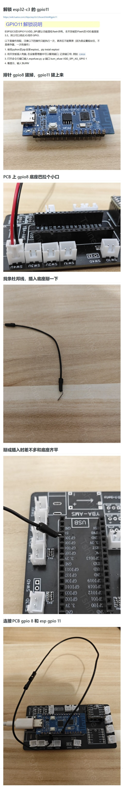

复刻 [YBA-AMS-ESP](https://github.com/YBA0312/YBA-AMS-ESP/tree/main) 固件ESP，修复第4通道无法使用BUG，优化断连问题。

## 固件
下载地址：待打包

## 使用
唯一的区别是配网, 手机安装 EspTouch APP，或者小程序也可以，请自行研究查找

## 关于第四通道
1. 需要将原来的 gpio8 更换为 gipo11，如果你的PCB是原版的话需要飞线操作。
2. 既然换了 gpio 则必须更换固件，你可以自行修改原版代码，也可以使用这里的 python版。

下面是飞线教程

